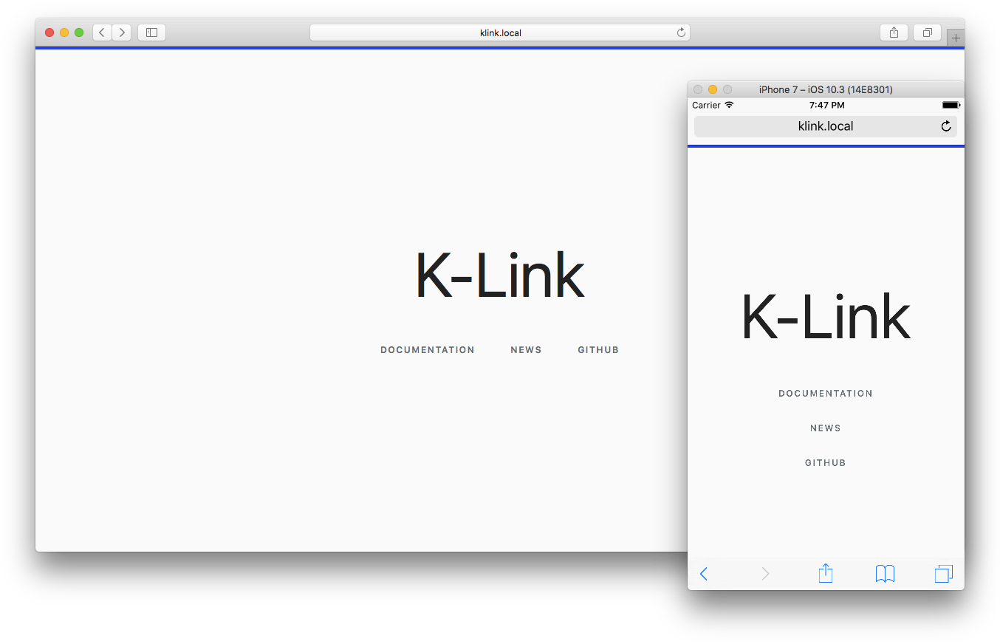

# K-Link

Connects various information sources to a common digital library and provides search, retrieval and exchange of information from different platforms.

Please **[visit the website](https://oneofftech.xyz/k-link/)** for more information!

If you find any issues with this application, please report them at the [issue tracker](./issues). Contributions are both encouraged and appreciated. If you like to contribute please check the website for more information.

The upstream repository is at: https://github.com/k-box/k-link

## Installation

K-Link can be installed on most operating systems. The installation is heavily based on [Docker](https://www.docker.com/).

### Prerequisites

- Check the [system requirements](./docs/requirements.md).
- Use an operating system [supported by Docker](https://docs.docker.com/install/#server) (ideally GNU/Linux; we use [Debian](https://debian.org))
- Make sure you have installed a recent version of [Docker](https://docs.docker.com/install/linux/docker-ce/debian/) and [Docker Compose](https://docs.docker.com/compose/install/).

### Simplest installation

These few commands allow you to quickly install a K-Link **locally** on your computer for testing purposes.

* Create a directory: `mkdir k-link && cd k-link`
* Download configuration file: `curl -o docker-compose.yml https://raw.githubusercontent.com/k-box/k-link/master/docker-compose.example.yml`
* Start up services: `docker-compose up -d` (running this for the first time, it will download a lot of data and take a while)
* Visit your K-Link Registry: [http://localhost:8181/registry](http://localhost:8181/registry) (you can login to the K-Link Registry with the username `admin` and the password `123456789`.)

For an installation on a server in the Internet or more configuration options, see the documentation on [installation of the K-Link](./docs/installation.md). There you set relevant passwords, which is important when using the Software for any purpose.

## Components

The K-Link consists in different components:

| Name | Image | Based on | Description |
|------|-------|----------|-------------|
| [K-Link Website](./docs/website.md) | `klink` | Static HTML | A simple website, the public face of a K-Link |
| [K-Link Registry](https://github.com/k-box/k-link-registry) | `registry` | PHP and Symfony 4 | Orchestrator of applications connected to a K-Link and their permissions |
| Database | `registry-db` | MariaDB | A database for the use of the K-Link Registry application. |
| [K-Search API](https://github.com/k-box/k-search) | `ksearch` | PHP and Symfony 4 | Full text search component used for K-Link and K-Box |
| [K-Search Engine](https://github.com/k-box/k-search-engine) | `engine` | Apache SOLR | Open Source search engine pre-configured for the K-Search |

## License

This program is Free Software: You can use, study share and improve it at your will. Specifically you can redistribute and/or modify it under the terms of the [GNU Affero General Public License](./LICENSE.txt) version 3 as published by the Free Software Foundation.

**Your contribution is very welcome**. Find more information in our [contribution guide](./contributing.md).
